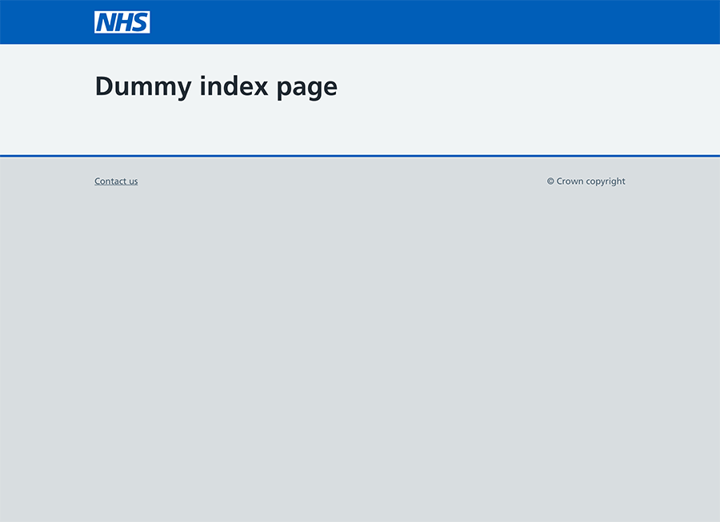

# design-history-template
Base templates for design history prototypes

## Local development

Create virtualenv

```
python3 -m venv venv
```

Activate virtualenv

```
. venv/bin/activate
```

Install requirements

```
pip install -r requirements.txt
```


Run development server
```
./run.sh
```

Development server runs on [http://localhost:5000](http://localhost:5000) where you should see this:


